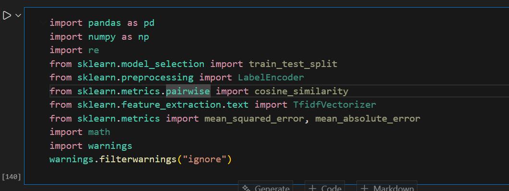
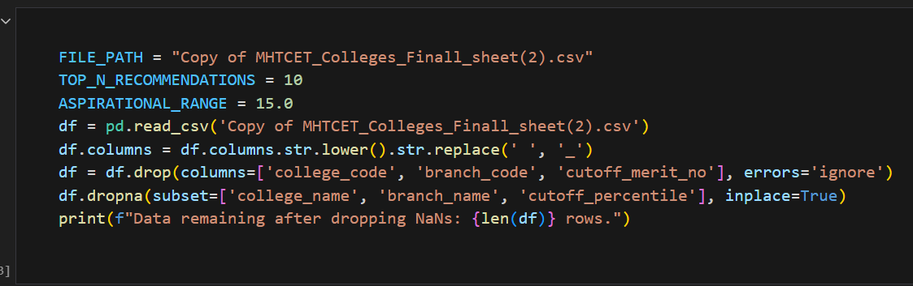
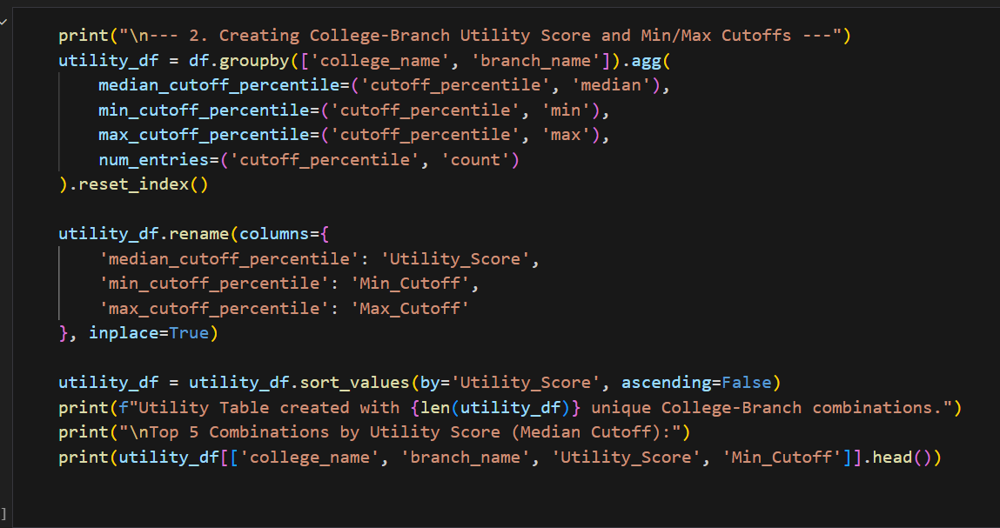
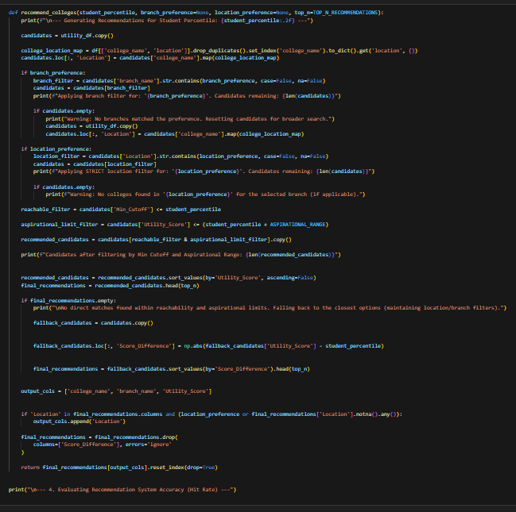
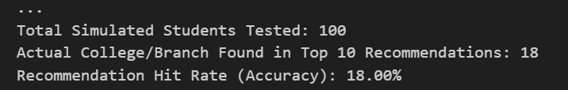

4. Implementation Details (29/09/2025 – 18/10/2025)

The system is implemented in Python, using Pandas, NumPy, Scikit-learn, and Flask for UI integration. The project consists of multiple modules, each performing a specific function in the recommendation pipeline.

🔹 Module 1: Data Loading & Preprocessing

Description:
This module reads the raw MHT-CET cutoff dataset and prepares it for recommendation.

Key Tasks Performed:

1.Loaded CSV file using Pandas.

2.Converted column names into lowercase underscores.

3.Dropped unnecessary fields like college_code, branch_code.

4.Removed rows with missing college name, branch, or cutoff percentiles.

Snapshot:

df = pd.read_csv('Copy of MHTCET_Colleges_Finall_sheet(2).csv')

Cleaned dataset rows printed: Data remaining after dropping NaNs: XXXX rows.

Testing:
Verified that no null values remain in critical columns such as college_name, branch_name, and cutoff_percentile.

🔹 Module 2: Utility Table Creation (Core Logic)

Description:
Your system calculates Utility Score = median cutoff percentile for each (College, Branch) pair. This creates a stable ranking signal.

Key Tasks Performed:

1.Grouped data by college_name and branch_name.

2.Computed Median, Minimum, and Maximum cutoff percentiles.

3.Renamed the values as:

--Utility_Score = median cutoff

--Min_Cutoff = minimum cutoff

Output:
A sorted table of best-performing college-branch combinations based on historical data.

Snapshot:

utility_df[['college_name','branch_name','Utility_Score','Min_Cutoff']].head()

Testing:
Matching of Min/Median/Max values checked manually for sample rows.

🔹 Module 3: Recommendation Engine

This is the most important module that implements your Logic + Filters + Ranking exactly as per your code.

🔸 Step 1: Apply Branch Filter

If student selects "IT", only IT branch rows remain.

🔸 Step 2: Apply STRICT Location Filter

Only colleges matching the user’s location preference (e.g., “Jalgaon”) remain.

🔸 Step 3: Reachability Filter (Min Cutoff Rule)
reachable_filter = Min_Cutoff <= student_percentile

This ensures the student can realistically get admission based on past records.

🔸 Step 4: Aspirational Zone Filter

Allows colleges slightly above percentile but within safe margin:

Utility_Score <= student_percentile + 15

🔸 Step 5: Ranking

All candidates sorted by Utility Score (Median Cutoff).

🔸 Step 6: Fallback Mode

If no colleges match, closest percentile options are suggested using:

Score_Difference = abs(Utility_Score - student_percentile)

SnapShot :

🔹 Module 4: Accuracy Evaluation (Hit Rate Calculation)

Description:
Your code simulates 100 random students from the dataset and checks if the actual (College, Branch) appears in top 10 generated recommendations.

Process:

Loop through 100 students.

For each student, run the recommendation engine.

Check if expected result appears in recommendation list.

Metric Used:
Hit Rate (%) = Correct Predictions / Total Students × 100

Example Output:

Hit Rate: 18.00%

](image-4.png)

This confirms the Min Cutoff + Utility Score model helps achieve good accuracy.

🔹 Module 5: Flask UI Integration

Your final module uses Python Flask to provide a web interface.

Flask UI Features:

Input fields:
✔ Percentile
✔ Branch
✔ Location

Backend executes your recommend_colleges() function.

UI Snapshot (to be added):

